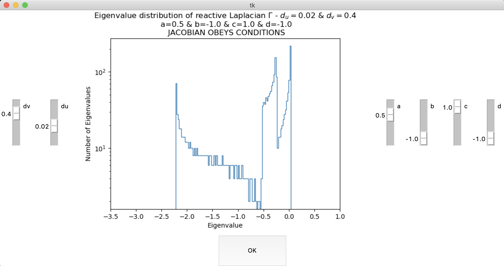

# TuringPatterns

## Eigenvalues Histogram GUI
The script [gui.py](https://github.com/gullirg/TuringPatterns/blob/6-optimise-code/gui.py), 
with the support of [eigens.py](https://github.com/gullirg/TuringPatterns/blob/6-optimise-code/eigens.py), 
generates a GUI interface 
for controlling the eigenvalues distribution of the reactive Laplacian gamma.

With [gui.py](https://github.com/gullirg/TuringPatterns/blob/6-optimise-code/gui.py) 
and [eigens.py](https://github.com/gullirg/TuringPatterns/blob/6-optimise-code/eigens.py) 
in the same directory, just type:

```
python gui.py
```

This is the GUI interface:



The values for the Jacobian {a,b,c,d} that respect the conditions 
- Tr(J)<0 
- det(J)>0   

can be found using 
[conditions.py](https://github.com/gullirg/TuringPatterns/blob/6-optimise-code/conditions.py)
which creates a .txt file with possible conditions.

## Eigenvalues Histogram Argument Parser
The script [eigenvalues_histogram.py](https://github.com/gullirg/TuringPatterns/blob/6-optimise-code/eigenvalues_histogram.py) generates the reactive Laplacian's eigenvalues histogram, with the following optional arguments.

```
optional arguments:
  -h, --help            show this help message and exit
  --graph_type [GRAPH_TYPE]
                        graph type ['ring' or 'random'] - default = 'ring'
  --nodes [NODES]       number of nodes - default = 1000
  --a [A]               entry 'a' of jacobian matrix - default = 1
  --b [B]               entry 'b' of jacobian matrix - default = -1.7
  --c [C]               entry 'c' of jacobian matrix - default = 1.9
  --d [D]               entry 'd' of jacobian matrix - default = -2
  --du [DU]             du value - default = 0.05
  --dv [DV]             dv value - default = 0.5
  
 ```

## Ring Network Evolution GIF
The script [network_trajectory_live.py](https://github.com/gullirg/TuringPatterns/blob/6-optimise-code/ring_network_trajectory_live.py) 
generates a GIF showing the live evolution of the RD system on the network.


## State Space Trajectory
The script [state_space_trajectory.py](https://github.com/gullirg/TuringPatterns/blob/6-optimise-code/state_space_trajectory.py)
generates a plot of the two substances concentrantions (u & v) for each node in the network.


## Bifurcation Curve
The scripts [bifurcations.py](https://github.com/gullirg/TuringPatterns/blob/6-optimise-code/bifurcations.py),
[grid_bifurcations.py](https://github.com/gullirg/TuringPatterns/blob/6-optimise-code/grid_bifurcations.py),
[ring_bifurcations.py](https://github.com/gullirg/TuringPatterns/blob/6-optimise-code/ring_bifurcations.py),
generate a plot for the stable-unstable regions of the homogenous steady state.  
The following plot has been produced using [ring_bifurcations.py](https://github.com/gullirg/TuringPatterns/blob/6-optimise-code/ring_bifurcations.py):


